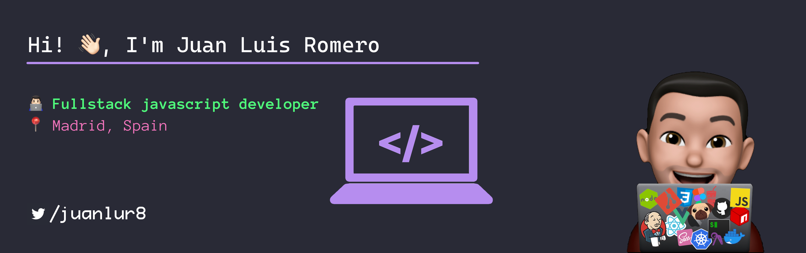

# Hi! 👋 I'm Juan Luis Romero

> 💡 "Don't worry if it doesn't work right. If everything did, you'd be out of a job."
  
## Currently working with 👨🏻‍💻

- 🦄 Frontend using `Vue 3` with `Typescript`, store built with `Pinia`
- 🧪 Frontend testing:
  - unit: `testing-library` and `vitest`
  - e2e: `cypress`
- 💻 Backend Rest API built with `Spring Boot`

---

## Coding Stack 🚀

<!-- 
  badges  -> https://shields.io
  icons   -> https://simpleicons.org/
 -->

---

## About me 🙋🏻‍♂️

- 🎬 Cinephile
- ✈ Traveler
- 📍 Spain
